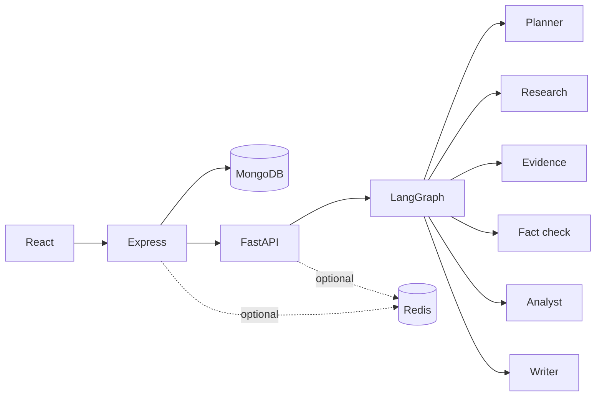

# ResearchX

Multi-agent AI research platform for free local demos and free-tier public deployment.

React → Express/MongoDB → FastAPI/LangGraph → sourced, fact-checked reports (optional PDF RAG).

## Overview

ResearchX turns a research question into a citation-grounded report with evidence, claims, contradiction detection, quantitative analysis, and charts. Designed as a B.Tech / final-year showcase that stays **free to build, run, and deploy**.

## Architecture



Details: [docs/architecture.md](docs/architecture.md)

## Major features

- Auth, projects, research sessions
- Background research jobs + SSE progress
- Web research, evidence, claims, citations, fact checking
- Contradiction detection, iterative research
- Quantitative analysis + charts
- PDF/document RAG + hybrid web+document research
- Evaluation/benchmarking, performance instrumentation
- Security hardening (JWT, SSRF guards, AI service token, rate limits)
- Optional Redis cache; Docker Compose local stack

## Technology stack

| Layer | Stack |
|-------|--------|
| Web | React 18, TypeScript, Vite, Tailwind |
| Server | Node.js, Express, Mongoose, JWT, optional ioredis |
| AI | Python 3.11+, FastAPI, LangGraph, Chroma, FastEmbed |
| Data | MongoDB (source of truth), optional Redis, local files |
| Free providers | Mock / Ollama / Groq free tier / DuckDuckGo |

## Local setup

### Prerequisites

- Python 3.11+ (venv at repo `.venv/`)
- Node.js 18+
- MongoDB **or** Docker
- Optional: Redis

### Install

```powershell
.\.venv\Scripts\Activate.ps1
pip install -r apps/ai-service/requirements.txt
npm install
```

### Environment

```powershell
copy .env.example .env
# also configure apps/server/.env and apps/web/.env as needed
```

See `.env.example` for the full variable list. **Never commit secrets.**

### Run (one command)

```powershell
cd "c:\GENAI PROJECT\researchx-ai"
npm run dev
```

This frees ports 5000/8000/5173, then starts AI + Express + Web together.

Open: http://127.0.0.1:5173

MongoDB must already be running (`mongodb://127.0.0.1:27017/researchx`).

### Run (separate terminals)

```powershell
# Terminal 1 — AI
npm run dev:ai

# Terminal 2 — Express
npm run dev:server

# Terminal 3 — Web
npm run dev:web
```

### Run (Docker)

```powershell
docker compose up --build
```

- Web: http://127.0.0.1:5173  
- Express health: http://127.0.0.1:5000/health  
- AI health: http://127.0.0.1:8000/health  

```powershell
docker compose down
```

Docs: [docker](docs/development/docker.md) · [redis](docs/development/redis.md) · [performance](docs/development/performance.md)

## Testing

```powershell
cd apps\ai-service
..\..\.venv\Scripts\python.exe -m pytest -q
npm run test -w researchx-server
npm run test -w researchx-web
npm run build -w researchx-web
```

Primary product regression: `apps/server/tests/e2e.smoke.test.ts`.

See [docs/testing.md](docs/testing.md).

## Free deployment

Portable HTTP services + free Mongo tier + optional free Redis. No Kubernetes/Kafka/paid infra required.

Full guide + checklist: **[docs/deployment.md](docs/deployment.md)**

## Screenshots / demo

_Placeholder — add UI screenshots of dashboard, progress SSE view, and final report for presentations._

## Limitations

- Free LLM/search tiers have rate limits and cold starts
- Background jobs are in-process threads (survive request end; restart may drop in-flight jobs — durable outputs still on disk/Mongo when finished)
- Redis outage is safe; unfinished jobs after process kill need a new run
- Production should set `AI_SERVICE_TOKEN`, strong `JWT_SECRET`, and keep FastAPI/Mongo/Redis private

## Documentation

- [Architecture](docs/architecture.md)
- [Deployment](docs/deployment.md)
- [Security](docs/development/security.md)
- [Document RAG](docs/architecture/document-rag.md)
- [PRD](PRD.md)
