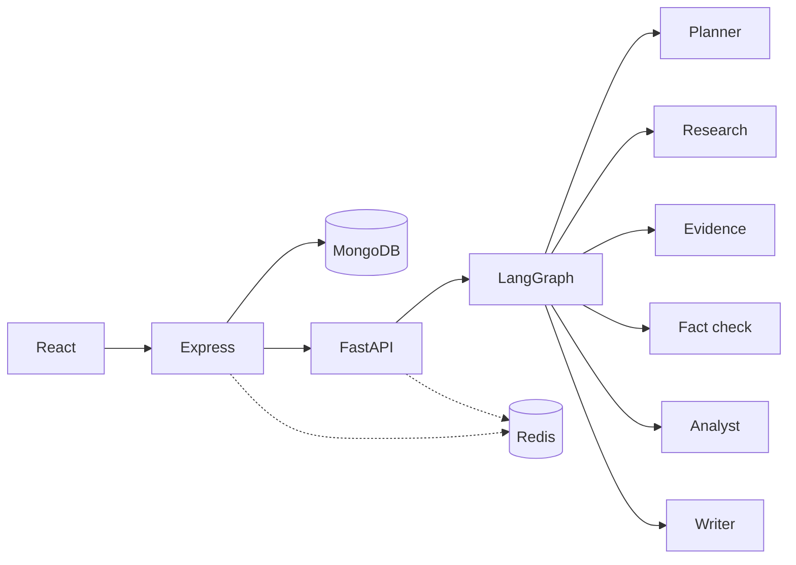

# ResearchX

Multi-agent research assistant: ask a question, get a sourced report with fact-checks, analysis, and optional PDF RAG.

**Stack:** React → Express + MongoDB → FastAPI + LangGraph

## Architecture



More detail: [docs/architecture.md](docs/architecture.md)

## Features

- Auth, projects, research sessions
- Background jobs with live progress (SSE)
- Web research, evidence, claims, citations, fact-checking
- Contradiction detection and iterative research
- Quantitative analysis and charts
- PDF / document RAG (including hybrid web + docs)
- Evaluation benchmarks
- Optional Redis cache
- Docker Compose for local full stack

## Tech stack

| Layer | Tech |
|-------|------|
| Web | React 18, TypeScript, Vite, Tailwind |
| API | Node.js, Express, Mongoose, JWT |
| AI | Python, FastAPI, LangGraph, Chroma, FastEmbed |
| Data | MongoDB, optional Redis, local files |
| Providers | Mock, Ollama, Groq, Gemini, DuckDuckGo |

## Setup

**Needs:** Python 3.11+, Node 18+, MongoDB (or Docker). Redis optional.

```powershell
cd "c:\GENAI PROJECT\researchx-ai"
.\.venv\Scripts\Activate.ps1
pip install -r apps\ai-service\requirements.txt
npm install
copy .env.example .env
```

Also keep `apps/server/.env` and `apps/web/.env` configured (see `.env.example`).

## Run

```powershell
npm run dev
```

Opens AI `:8000`, Express `:5000`, and web `:5173`. App: http://127.0.0.1:5173

MongoDB should be available at `mongodb://127.0.0.1:27017/researchx`.

Individual processes: `npm run dev:ai` | `npm run dev:server` | `npm run dev:web`

### Docker

```powershell
docker compose up --build
docker compose down
```

## Tests

```powershell
cd apps\ai-service
..\..\.venv\Scripts\python.exe -m pytest -q
npm run test -w researchx-server
npm run test -w researchx-web
```

See [docs/testing.md](docs/testing.md).

## Deployment

Free path (Atlas + Render): see **[docs/deployment.md](docs/deployment.md)**.

Blueprint file: `render.yaml` (Render → New → Blueprint).

## Limitations

- Free LLM/search APIs have rate limits
- In-process research workers: a process restart can drop jobs that were still running
- Set `AI_SERVICE_TOKEN` and a strong `JWT_SECRET` before any public deploy; keep FastAPI/Mongo/Redis private

## Docs

- [Architecture](docs/architecture.md)
- [Deployment](docs/deployment.md)
- [Security](docs/development/security.md)
- [Document RAG](docs/architecture/document-rag.md)
- [PRD](PRD.md)
