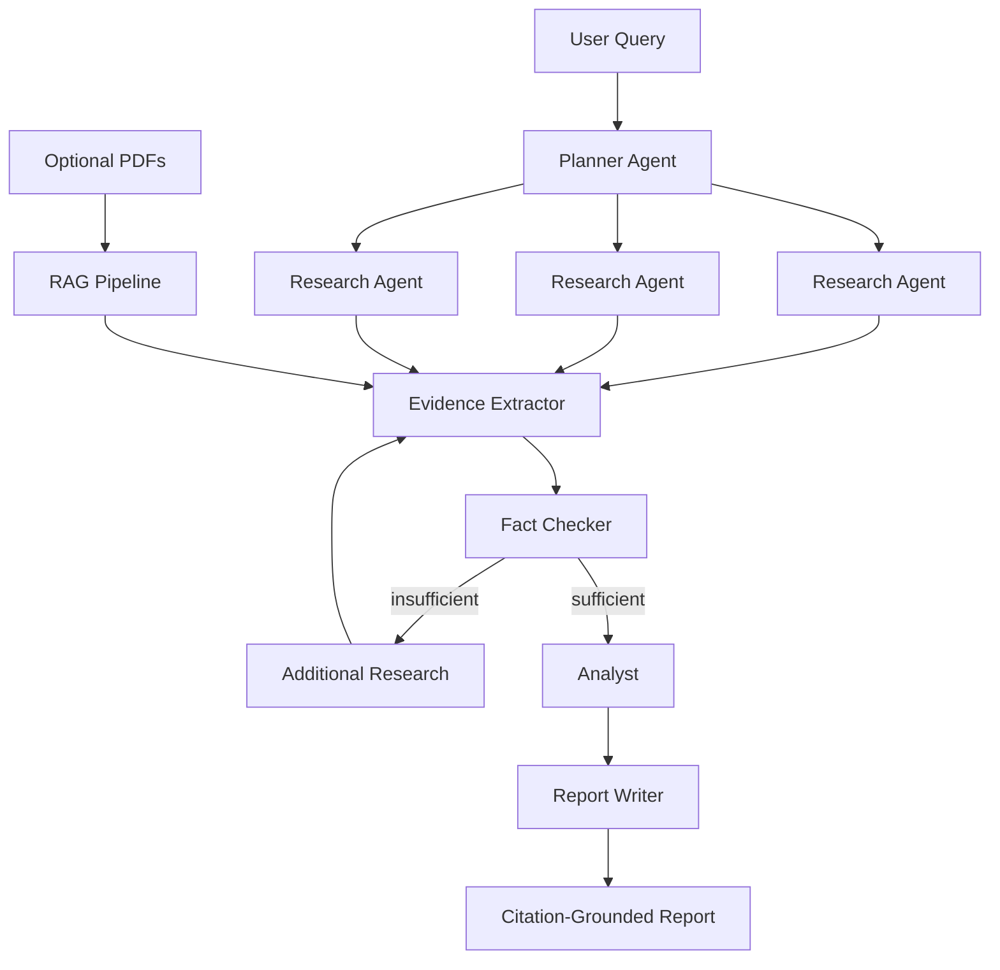

# ResearchX — Multi-Agent AI Research & Intelligence Platform

**Python AI Engine** (B.Tech final-year project prototype)

ResearchX turns a research question into a **citation-grounded report** using a multi-agent pipeline:

Planner → Parallel Researchers → Evidence Extractor → Fact Checker → Analyst → Writer

This repository contains the **Python AI/ML/agentic research pipeline only**.  
The React frontend, Node/Express backend, and auth will be integrated later.

---

## 1. Project overview

| Capability | Description |
|---|---|
| Multi-agent research | LangGraph-orchestrated agents with structured Pydantic I/O |
| Free/open providers | Ollama (local), Groq free tier, Gemini free tier |
| Free search | DuckDuckGo (default), Tavily / Serper free tiers |
| Evidence & citations | Every claim links Evidence → Source → URL |
| Contradiction detection | Rule-based + LLM-assisted |
| Quantitative analysis | Pandas/NumPy/Calculator — not LLM arithmetic |
| PDF RAG | PyMuPDF → FastEmbed → ChromaDB |
| Mock mode | Full offline pipeline for demos and CI |

---

## 2. Architecture



### Provider abstractions

```text
LLMProvider
├── OllamaProvider
├── GroqProvider
├── GeminiProvider
└── MockLLMProvider

SearchProvider
├── DuckDuckGoProvider   (default, no key)
├── TavilyProvider
├── SerperProvider
└── MockSearchProvider
```

---

## 3. Agent descriptions

| Agent | Responsibility |
|---|---|
| **Planner** | Decompose question into non-duplicate subtasks |
| **Researcher** | Generate queries, search, fetch pages, rank sources |
| **Extractor** | Pull structured claims with verbatim evidence |
| **Fact Checker** | Verify support, detect contradictions, request more research |
| **Analyst** | YoY, CAGR, rankings, chart-ready JSON |
| **Writer** | Executive summary → references with citations |

---

## 4. Setup instructions

### Prerequisites

- Python **3.11+**
- (Optional) [Ollama](https://ollama.com) for local LLMs
- (Optional) Free API keys for Groq / Gemini / Tavily / Serper

### Install

```bash
cd researchx-ai
python -m venv .venv

# Windows PowerShell
.\.venv\Scripts\Activate.ps1

# macOS / Linux
source .venv/bin/activate

pip install -r requirements.txt
cp .env.example .env
```

---

## 5. Free provider setup

### Ollama (recommended zero-cost default)

1. Install Ollama and pull a model:

```bash
ollama pull llama3.2
```

2. Configure `.env`:

```env
LLM_PROVIDER=ollama
LLM_MODEL=llama3.2
OLLAMA_BASE_URL=http://localhost:11434
SEARCH_PROVIDER=duckduckgo
```

### Groq free tier

```env
LLM_PROVIDER=groq
LLM_MODEL=llama-3.3-70b-versatile
GROQ_API_KEY=your_primary_key_here
GROQ_API_KEY_2=your_backup_key_here
GROQ_API_KEY_3=your_second_backup_key_here
```

If the primary key hits a rate limit (HTTP 429), ResearchX automatically rotates to `GROQ_API_KEY_2`, then `GROQ_API_KEY_3`.

### Google Gemini free tier

```env
LLM_PROVIDER=gemini
LLM_MODEL=gemini-2.0-flash
GEMINI_API_KEY=your_key_here
```

---

## 6. Search provider setup

| Provider | Key required? | Notes |
|---|---|---|
| `duckduckgo` | No | Default; rate limits possible |
| `tavily` | Yes (free tier) | Set `TAVILY_API_KEY` |
| `serper` | Yes (free tier) | Set `SERPER_API_KEY` |

Fallback is automatic: primary → fallback on failure/empty results.

```env
SEARCH_PROVIDER=duckduckgo
SEARCH_FALLBACK=duckduckgo
```

The crawler uses polite timeouts, retries, and a clear User-Agent. It does **not** bypass paywalls, CAPTCHAs, or authentication.

---

## 7. Environment variables

See [`.env.example`](.env.example) for the full list. Important ones:

| Variable | Default | Meaning |
|---|---|---|
| `LLM_PROVIDER` | `ollama` | `ollama` / `groq` / `gemini` / `mock` |
| `GROQ_API_KEY` | — | Primary Groq key |
| `GROQ_API_KEY_2` / `_3` | — | Optional Groq backups on rate limit |
| `SEARCH_PROVIDER` | `duckduckgo` | Search backend |
| `MAX_SOURCES` | `20` | Cap on collected sources |
| `MAX_RESEARCH_ITERATIONS` | `2` | Extra research loops |
| `MAX_CONCURRENT_AGENTS` | `3` | Parallel research workers |
| `MOCK_MODE` | `false` | Deterministic offline run |
| `OUTPUT_PATH` | `./data/outputs` | Report destination |

**Never commit `.env`.**

---

## 8. CLI examples

```bash
# Help
python main.py --help

# Mock end-to-end (no APIs)
python main.py "Analyze the Indian EV market from 2022 to 2026" --mock

# Standard research (needs Ollama or API key)
python main.py "Analyze the Indian EV market from 2022 to 2026" --depth deep

# With requirements
python main.py "Compare React and Vue for enterprise applications" --depth standard -r "focus on hiring" -r "SSR support"

# Hybrid: PDF + web
python main.py --file report.pdf "Compare this report with current market data"

# Force provider for one run
python main.py "AI impact on software engineering jobs" --provider groq
```

### Progress output

```text
ResearchX
────────────────────────────────
[1/7] Creating research plan... ✓
[2/7] Researching sources...
[3/7] Extracting evidence... ✓
[4/7] Fact checking...
[5/7] Running analysis... ✓
[6/7] Generating report... ✓
[7/7] Saving results... ✓
```

### Output layout

```text
data/outputs/RES_YYYYMMDD_HHMMSS_xxxxxx/
    report.md
    report.json
    sources.json
    claims.json
    contradictions.json
    analysis.json
```

---

## 9. RAG usage

1. Place or pass PDF paths via `--file`.
2. Pipeline: **PyMuPDF → chunk → FastEmbed → ChromaDB → Retriever**.
3. Retrieved chunks become `Source` objects (`source_type=pdf`) with `document_id`, `page`, `chunk_id`.
4. They merge with web sources before fact-checking (hybrid research).

First FastEmbed run may download the embedding model (`BAAI/bge-small-en-v1.5`).

---

## 10. FastAPI service

Thin HTTP layer around the existing Python pipeline (no duplicated research logic).

### Install & run

```bash
pip install -r requirements.txt
uvicorn api.main:app --reload --host 127.0.0.1 --port 8000
```

Swagger UI: http://127.0.0.1:8000/docs  
ReDoc: http://127.0.0.1:8000/redoc

### API environment variables

| Variable | Default | Meaning |
|---|---|---|
| `API_HOST` / `API_PORT` | `127.0.0.1` / `8000` | Bind address (for docs/scripts) |
| `CORS_ORIGINS` | localhost:3000,5173 | Comma-separated origins (no `*` unless intentional) |
| `API_DEBUG` | `false` | Debug flag |
| `APP_VERSION` / `APP_ENV` | `0.1.0` / `development` | Health metadata |

### Endpoints

| Method | Path | Purpose |
|---|---|---|
| GET | `/health` | Liveness + provider status (no secrets) |
| POST | `/api/v1/research` | Start research (202 + `research_id`) |
| GET | `/api/v1/research` | List sessions |
| GET | `/api/v1/research/{id}` | Full result |
| GET | `/api/v1/research/{id}/status` | Stage + approx progress |
| GET | `/api/v1/research/{id}/sources` | Sources |
| GET | `/api/v1/research/{id}/claims` | Claims |
| GET | `/api/v1/research/{id}/report` | Report |
| POST | `/api/v1/evaluation/run` | Run eval suite |
| GET | `/api/v1/evaluation/latest` | Latest eval JSON |

### Example curl (mock)

```bash
# Health
curl http://127.0.0.1:8000/health

# Start research
curl -X POST http://127.0.0.1:8000/api/v1/research \
  -H "Content-Type: application/json" \
  -d "{\"query\":\"Analyze the Indian EV market from 2022 to 2026\",\"mock_mode\":true,\"depth\":\"quick\"}"

# Poll status (replace RESEARCH_ID)
curl http://127.0.0.1:8000/api/v1/research/RESEARCH_ID/status

# Result / sources / claims / report
curl http://127.0.0.1:8000/api/v1/research/RESEARCH_ID
curl http://127.0.0.1:8000/api/v1/research/RESEARCH_ID/sources
curl http://127.0.0.1:8000/api/v1/research/RESEARCH_ID/claims
curl http://127.0.0.1:8000/api/v1/research/RESEARCH_ID/report
```

Research runs in a **background thread**. Poll status until `completed`, then fetch results. Progress percentages are stage approximations (not streaming yet).

---

## 11. Testing

```bash
pytest -q
python main.py "test research question" --mock
```

Tests mock LLM/search — **no paid APIs required**.

---

## 12. Evaluation & benchmarking

ResearchX includes a local evaluation framework to quantify whether the assistant retrieves useful sources, grounds claims, cites correctly, avoids unsupported statements, and computes numbers accurately.

### Why evaluation matters

Without measurable metrics, pipeline regressions are invisible. The eval suite produces numbers suitable for a dashboard and final-year project documentation.

### Benchmark dataset

22 questions in `evaluation/benchmarks.json` covering:

| Category | Purpose |
|---|---|
| General factual | Basic research quality |
| Multi-source comparison | Diversity + synthesis |
| Numerical analysis | Deterministic arithmetic checks |
| Conflicting information | Contradiction detection |
| Multi-step | Iterative research |
| Insufficient evidence | Honesty under sparse data |
| Citation correctness | Reference integrity |
| Hallucination traps | Fabricated facts/standards |

Each item has `id`, `question`, `expected_subtopics`, optional `expected_claims` / `expected_values`, difficulty, and flags (`expect_contradiction`, `expect_insufficient`, `use_synthetic_quant`). Exact web URLs are avoided so the suite is not brittle.

### Metrics

| Area | Metrics | Type |
|---|---|---|
| Sources | relevance, diversity, useful count, duplicate rate | heuristic |
| Evidence | coverage, relevance, completeness, traceability | deterministic/heuristic |
| Claims | support rate, unsupported/conflicting rates | deterministic |
| Citations | coverage, correctness, completeness | deterministic |
| Hallucination | unsupported/total (proxy); fabricated-number heuristic | heuristic |
| Numerical | abs/rel error vs gold values via `Calculator` | **deterministic only** |
| Completeness | topic / claim-hint coverage | heuristic |
| Efficiency | wall time, iterations, source/claim counts, stage timings | deterministic |
| LLM judge (optional) | relevance, completeness, groundedness, clarity | llm-assisted |

**Limitation:** hallucination rate is a *proxy* (unsupported claims ÷ total). It can false-positive when verification is conservative and false-negative when bad claims are mislabeled supported. Never use the LLM judge for arithmetic.

### How to run

```bash
# Full mock suite (no paid APIs) — recommended for CI / demos
python -m evaluation.run --mock

# Subset
python -m evaluation.run --mock --limit 5
python -m evaluation.run --mock --ids B21,B19

# Optional qualitative judge (uses mock LLM when MOCK_MODE=true)
python -m evaluation.run --mock --judge

# Promote current results to baseline for regression diffs
python -m evaluation.run --mock --save-baseline

# Later: live providers
python -m evaluation.run --live
```

Outputs:

```text
evaluation/results/
  latest.json              # full per-question + aggregate
  dashboard.json           # frontend-ready JSON
  baseline.json            # optional regression baseline
  evaluation_report.md     # human-readable Markdown report
```

### Regression comparison

When `baseline.json` exists, the Markdown report includes baseline vs current for each primary metric (improved / regressed / unchanged). Lower is better for `hallucination_rate`. No arbitrary pass/fail gates are enforced.

### Example overall block

```json
{
  "overall": {
    "claim_support_rate": 0.86,
    "citation_coverage": 0.91,
    "hallucination_rate": 0.07,
    "numerical_accuracy": 0.95
  },
  "performance": {
    "avg_execution_time": 2.1,
    "avg_sources": 6.0,
    "avg_iterations": 0.5
  }
}
```

---

## 13. Folder structure

```text
researchx-ai/
├── main.py                 # CLI entrypoint
├── api/                    # FastAPI layer (thin orchestration)
│   ├── main.py
│   ├── routes/
│   ├── schemas/
│   └── services/
├── config.py               # pydantic-settings
├── agents/                 # Planner, Researcher, Extractor, FactChecker, Analyst, Writer
├── graph/                  # LangGraph state + workflow
├── providers/llm|search/   # Free provider abstractions
├── tools/                  # Search, fetch, extract, PDF, calculator
├── evidence/               # Claims, citations, contradictions, quality scores
├── rag/                    # Embeddings, Chroma, retriever, pipeline
├── analysis/               # Metrics, stats, charts
├── prompts/                # Externalized agent prompts
├── schemas/                # Pydantic models
├── storage/                # Cache + JSON output store
├── evaluation/             # Benchmarks, metrics, runner, regression, reports
│   ├── benchmarks.json
│   ├── run.py              # python -m evaluation.run
│   └── results/            # latest.json, dashboard.json, evaluation_report.md
├── tests/
└── data/                   # cache, documents, outputs, chroma
```

---

## 14. Troubleshooting

| Problem | Fix |
|---|---|
| `Connection refused` to Ollama | Start Ollama; check `OLLAMA_BASE_URL`; `ollama list` |
| Empty DuckDuckGo results | Retry later, or set Tavily/Serper keys as fallback |
| JSON validation errors from LLM | Use a stronger model; mock mode for demos |
| Slow first RAG run | FastEmbed downloading model weights |
| Import errors | Activate venv; `pip install -r requirements.txt` |
| pytest can't find modules | Run from `researchx-ai/` root |

---

## 15. Future Node backend integration

The Python engine is designed to be wrapped later as an API:

1. Expose `ResearchWorkflow.run()` via FastAPI (or call from Node through a worker).
2. Persist `data/outputs/<id>/*` into MongoDB when the Node backend lands.
3. Stream progress events (the CLI callback pattern maps cleanly to WebSockets).
4. Keep provider selection in env so the UI can remain backend-agnostic.

---

## 16. Design principles

1. Free / open-source first  
2. Simple over clever  
3. Modular provider abstractions  
4. Every claim needs evidence  
5. Never invent citations  
6. External content is **untrusted data** (prompt-injection boundaries in prompts)  
7. Explainable to a B.Tech viva panel  

---

## License

Academic / educational project use.
