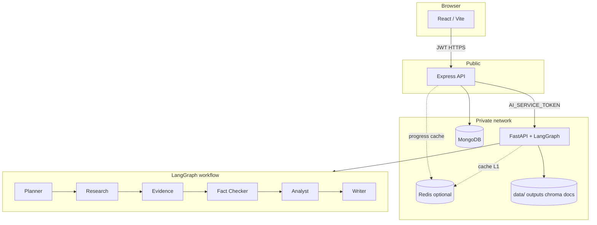

# Architecture

## Research job flow

1. `POST /api/v1/research` (Express) creates a Mongo `ResearchSession` and calls FastAPI.
2. FastAPI returns `research_id` immediately (`202`) and runs LangGraph in a **background thread**.
3. Progress is mirrored to local session JSON + optional Redis TTL keys.
4. Frontend uses **SSE** `GET /api/v1/research/:id/events` (with polling fallback).
5. `POST /api/v1/research/:id/cancel` marks Mongo cancelled and best-effort stops the FastAPI job at the next progress checkpoint.
6. On completion, Express syncs report/sources/claims into Mongo (durable).

Statuses: `queued` → `running` → `completed` | `failed` | `cancelled`.

## Free-first constraints

- No Kafka / Kubernetes
- Redis optional
- Docker optional for production
- Providers selectable via env (`mock`, `ollama`, `groq`, `gemini`, `duckduckgo`, …)
