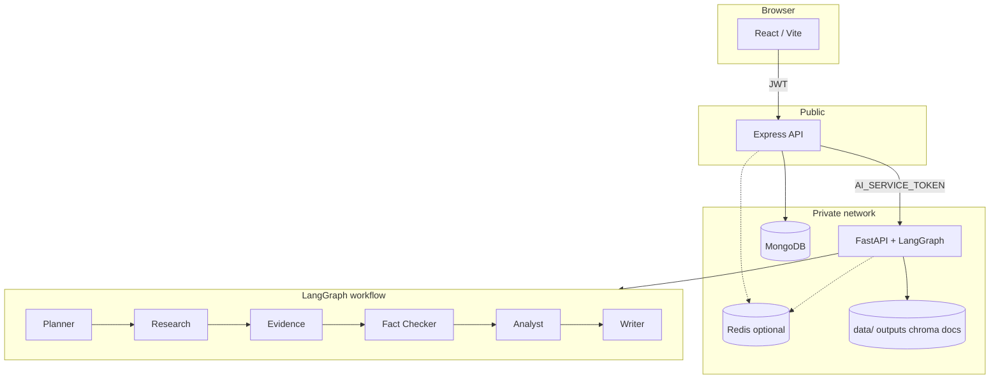

# Architecture

## Research job flow

1. `POST /api/v1/research` creates a Mongo session and starts FastAPI work.
2. FastAPI returns `202` and runs LangGraph in a background thread.
3. Progress is stored in session files and optionally Redis.
4. The UI follows progress via SSE (`GET /api/v1/research/:id/events`) or polling.
5. Cancel (`POST .../cancel`) marks the job cancelled; the worker stops at the next progress update.
6. When finished, Express syncs the report and artifacts into MongoDB.

Statuses: `queued` → `running` → `completed` | `failed` | `cancelled`.

## Notes

- Redis and Docker are optional.
- LLM / search providers are selected with env vars (`mock`, `ollama`, `groq`, `gemini`, `duckduckgo`, …).
